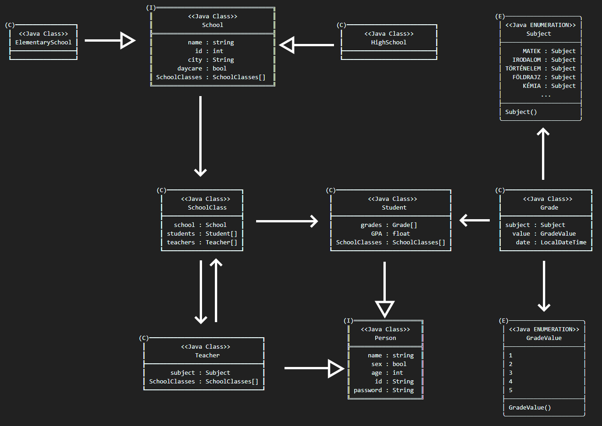

# elte-fsz-20-ETeam

## Feladat

    Iskolai osztálynapló.

## Osztálydiagram

    

## Osztályok leírása

    School
        name: Iskola neve.
        id: Iskola egyedi azonosítója (id, generated).
        city: Város, ahol az iskola található.
        daycare: Iskolaában van-e napközi.
        SchoolClasses: Iskolához tartozó iskolai osztályok (one to many).

    ElementarySchool
        School osztály leszármazottja.

    HighSchool
        School osztály leszármazottja.
        Daycare minden esetben false.

    Person
        name: Személy neve.
        sex: Személy neme.
        age: Személy életkora.
        id: Generált egyedi azonosító (id, generated value).
        password: Rendszerbe való bejelentkezéshez használt jelszó.

    Teacher
        Person osztály leszármazottja.
        subject: Az oktató álltal tanított tárgy. Ez alapján tud jegyet adni az álltala tanított osztályokaban szereplő diákoknak.
        SchoolCasses: Az oktató álltal tanított iskolai oszályok.

    Student
        Person osztály leszármazottja.
        grades: Tanuló érdemjegyei.
        GPA: Tanuló átlaga, amit a program autómatikusan kiszámol.
        SchoolClass: Melyik osztályba tartozik a diák (many to one).

    SchoolClass
        school: Osztály melyik iskolához tartozik (many to one).
        students: Osztályba tartozó diákok (one to many).
        teachers: Osztályt tanító tanárok (many to many).

    Grade
        subject: Milyen tantárgyhoz kapcsolódik az osztályzat.
        value: Osztályzat értéke.
        date: Osztályzat naplóbakerülésének dátuma, amit a program automatikusan rögzít.
